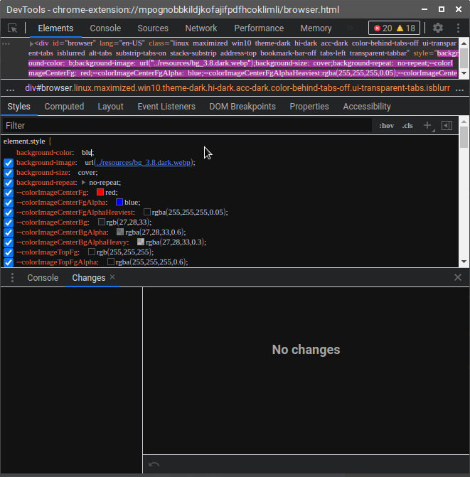

# Creating Your First Mod in CSS

In the previous guides you learned how to install mods, as well as how to open
and use the built-in DevTools for CSS. In this tutorial you'll learn how to
make a new mod using CSS.

Note that this tutorial assumes you have decent knowledge of CSS, please see
"Resources" if you need to learn CSS.

We'll try to solve the problem that Vivaldi's panels cannot be condensed past
a certain limit.

To start, open up devtools using your preferred method and open a panel. Using
the element selector, select the panel.


Notice the element tree:

```HTML
<div id="panels-container" class="right" style="width: 260px">
  <div id="panels">
    <div id="switch">
      <div class="panel-group">
        <div class="panel-collapse-guard">
          <div class="panel panel-bookmarks">
            <div class="webpanel-stack hidden">
  <button type="button" tabindex="-1" class="SlideBar SlideBar--FullHeight alternate" style="">

```

Clicking on each of them, and using the devtools "filter" option to search for
`width`, shows that `div.panel` has a `width` of `100%` (controlled by parent).

Its parent element, `div.panel-collapse-guard`, does have `min-width` and
`max-width` defined. However, lowering these values (to, something like
`100px`) just makes the panel look squashed, it doesn't decrease the space that
the panel takes up.


You should be able to press `Ctrl + Z` to undo the changes. The next element up
that has a defined width is `div#panels`, but that is also set to `100%`. The
next element up, and seemingly the only panel-related element left, is
`div#panels-container`. Adjusting it does change the width of the panel and
makes the panel take up less space, but it hides some panel content.


Correctly forcing a panel width will require changing both values: the width
of the panel container and the width of the panel itself. Try it yourself, and view the solution below.

> Tip: Changing element.style will make your changes harder to export. Instead,
use the "+" button in the styles tab to create a custom selector and style.
Here is an example of what not to do:
  -
> 

The main challenge with modding Vivaldi is that we didn't build the rest of the
app and we can't ask the people who did, so there is a lot of inspecting we
need to do. Sometimes you might need to inspect an element that autohides, or
use CSS selectors on an element that has no class or ID. You can see the Tips &
Tricks section of the guide to learn how to do things like that.


Here is the solution to the CSS mod:
```CSS
div#panels-container .panel-collapse-guard {
    max-width: 190px !important;
    min-width: 190px !important;
}

div#panels-container {
    width: 124px !important;
}
```

But, you may notice that the same value is repeated twice, and the second value
is just the first value + 34px (the width of `#panels-container #switch`, where
the panel buttons are). So we can use [CSS variables](#todo-mdn) like this:

```css

:root {
    --panel-condensed: 190px
}
div#panels-container .panel-collapse-guard {
    max-width: var(--panel-condensed) !important;
    min-width: var(--panel-condensed) !important;
}

div#panels-container {
    width: calc( var(--panel-condensed) + 34px) !important;
}
```

## Allowing for multiple setups

When modding it's important to think of different setups, such as having the
panel floating or having it inline (you can change this with a Ctrl-click on
the panel button in the status bar).

Make sure you test with open floating panel, closed floating panel, open inline
panel, closed inline panel, and right and left side panels.

## Making the mod user-friendly

We can make the mod more user-friendly by allowing the user to disable the mod
when the panel is not at its smallest position, using some CSS tricks.

Essentially, this allows the user to drag the panel to the smallest width
possible, and it will snap to an even smaller width. Remember, right-clicking
a panel button gives an option to make a certain panel a seperate width from
the others.

```css

:root {
    --panel-condensed: 190px

}
div#panels-container[style="width: 260px;"] .panel-collapse-guard {
    max-width: var(--panel-condensed) !important;
    min-width: var(--panel-condensed) !important;
}

div#panels-container[style="width: 260px;"] {
    width: calc( var(--panel-condensed) + 34px) !important;
}
```
