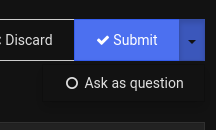

# Asking Questions on the Forum

Author(s): code3z (code3)

The [modding forum](https://forum.vivaldi.net/category/52/modifications)
is a great place to ask questions about modding. Before asking, search the
forum and the internet to check if there is not already a good answer.

When asking a question, keep a few simple things in mind:

- Use a topic title that is descriptive
- Be polite and don’t use ALL CAPS
- If you are asking questions about a certain piece of code, share that code
- Share any ways you thought might fix the problem even if they didn’t work
- Don’t add the “mod” or “modding” tags to your post—save that for when you
  actually publish a mod

## Asking for Mods

You can use the forum to ask someone to make a mod for you. But remember that it
is a big favor: if they wanted this mod themselves, they would have almost
certainly made it. So be patient, describe what you’re looking for clearly, and
realize that you may not get an answer at all (especially if what you’re asking
is hard to do).

If you think that what you’re asking for should be implemented in Vivaldi
directly, remember to make a feature request for it in the [correct section of
the forum](https://forum.vivaldi.net/category/113/feature-requests).

## Posting As A Question

Please use the drop-down menu next to the “Submit” button to mark your post
as a question, like this:

