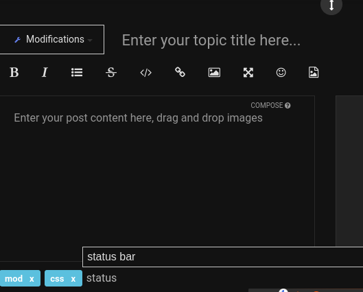
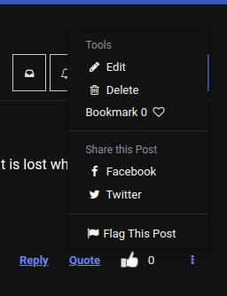

# Sharing your Mods
Author(s): code3z (@code3 on the forum)

Once you've created a mod that you're proud of, the next step is to share it.
Sharing will be a big help to other people. You can also get feedback and help
from the community. But it will also mean you have to respond to bugs in your
code and help other people use your code.

## Managing and Sharing Mods using Git

You can use hosted Git repos such as GitHub and Gitlab to upload, manage, share,
and collaborate on mods. See the Managing Mods section of this guide for more
information on Git.

## Code headers

Putting a comment at the top of your code helps people understand it,
use it, and remember where it came from. Consider using a header like this:

```Javascript OR CSS
/**
 * <TITLE>
 * https://forum.vivaldi.net/topic/<topic>
 * Description:        <description>
 *      <If your description is long, put the second part here>
 * Filename:          <filename>
 * Platform:          <Linux/Mac/Windows/All>
 * Version:           Vivaldi version <version>
 * Author(s):          <Here you can add your forum username, and username for github or any relevant app (also add any other contributors here)>
**/
```

### Versioning Your Mods

Instead of versioning your mods separately, it’s
easier and sometimes more helpful to include the latest version of Vivaldi that
it was tested in. Along with the last update time, this will let you and others
know how up-to-date the mod is.

Because both the forum and Git keep track of posting times, it's not necessary
to include the last update time in the code header (but you can if you want).

If you do want to version your mods, please include the Vivaldi version as well.
```
 * Version: 2.1 for Vivaldi 3.9.2289.3
```

If you want to keep it simple and use the last Vivaldi version, it would look
like this (see the header template above):

```
 * Version:           Vivaldi version 3.9.2289.3
```

## Tagging Forum Posts

Tagging your mods helps others find them. Use the forum tagging feature to
insert the following tags, in addition to any others that make sense:

 1. [Mod]
 2. [CSS] and/or [JS]
 3. [Area] (what area of the UI does it affect?)

If the tag doesn't exist, the forum software will create it—
but please don't make new tags on your own!
Only use tags that are suggested from the drop-down.



## Describing your mods

Now that you've added your code, titled your post, and tagged it,
you need to write content! What you write is really up to you, but be sure to
include what the mod does, how it will help people, and if it has any
shortcomings or bugs or if it does not work with certain settings.

You should also **include a screenshot**. If the mod does something that can only
be shown through a screen recording, take a screen recording and upload it as a GIF.
You can find some screen recording tools in the resources section of this guide.

Good job, I hope to see your mods soon! 👍

## Editing Posts

To edit a post and update the code, click the three-dot menu. Alternatively, if
using Git or cloud storage, just link to the file and
don't worry about updating your post each time.


